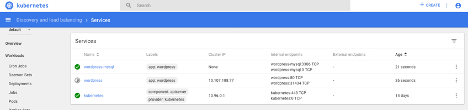

# 2Tier-Hybrid Application
 2Tier-Hybrid Application "VM based dB and Containterized WebUI"

In this lab, I am planning to spin up a VM in the openstack environment and setup MySQL dB running on it. For the webb front enf, I have spun up the front end on Wordpress docker pod, orchestrated through Kubernetes.

The common building block for this setup is Contrail as a CNI, which is a single tool to connect the front end and backend to operate a two tier application irrespective of the nature of the application. Contrail gets well integrated with multiple eco-systems, hence I am leveraging the power of contrail here to develop a fully functional two tier application among multiple eco systems.

This use case can help in migration techniques when the customer is moving to cloud or moving into the micro-services driven architecture to ensure that the customer can scale the infrastructure more around micro-services architecture.  The first step can be to migrate the front end from monolithic application to a containirized environment while still working with the backend dB. This lab setup, I will build something similar where the application will be operational in hybrid mode.

In this scenario, we will have two tiers, the front-end application is "WordPress" and  a SQL database. In my example I am using MySQL dB hosted in a virtual machine instance orchestrated through openstack.

Let’s spin up the frontend in the k8 environment. I have followed kubernetes documentation [link](https://kubernetes.io/docs/tutorials/stateful-application/mysql-wordpress-persistent-volume/) for the front-end containerized WEB-UI.

___
## Video Demo
If you would like to skip and like watching this in video, follow the [link](https://youtu.be/ZIwQ9jHTRW8).
___

Adjusting the persistent volume and the environment variables, following are the manifests in my lab environment.

###### Wordpress “App Tier” - The front-end deployment and the service.

~~~
[root@aio lab3]# cat 2tier-wordpress-dep-svc.yaml 
apiVersion: v1
kind: Service
metadata:
  name: wordpress
  labels:
    app: wordpress
spec:
  ports:
    - port: 80
  selector:
    app: wordpress
    tier: frontend
  type: LoadBalancer
---
apiVersion: apps/v1 # for versions before 1.9.0 use apps/v1beta2
kind: Deployment
metadata:
  name: wordpress
  labels:
    app: wordpress
spec:
  selector:
    matchLabels:
      app: wordpress
      tier: frontend
  strategy:
    type: Recreate
  template:
    metadata:
      labels:
        app: wordpress
        tier: frontend
    spec:
      containers:
      - image: wordpress:4.8-apache
        name: wordpress
        env:
        - name: WORDPRESS_DB_HOST
          value: 6.6.6.3                ### this is the host ip of VM hosting dB.
        - name: WORDPRESS_DB_PASSWORD
          value: mySQL!123#MySqL        ### this is the credentials for dB.
        ports:
        - containerPort: 80
          name: wordpress
~~~

###### MySQL “dB Tier” – The backend deployment and the service.

~~~
[root@aio lab3]# cat 2tier-mysql-dep-svc.yaml 
apiVersion: v1
kind: Service
metadata:
  name: wordpress-mysql
  labels:
    app: wordpress
spec:
  ports:
    - port: 3306
  selector:
    app: wordpress
    tier: mysql
  clusterIP: None
---
apiVersion: apps/v1 # for versions before 1.9.0 use apps/v1beta2
kind: Deployment
metadata:
  name: wordpress-mysql
  labels:
    app: wordpress
spec:
  selector:
    matchLabels:
      app: wordpress
      tier: mysql
  strategy:
    type: Recreate
  template:
    metadata:
      labels:
        app: wordpress
        tier: mysql
    spec:
      containers:
      - image: mysql:5.6
        name: mysql
        env:
        - name: MYSQL_ROOT_PASSWORD
          value: mySQL!123#MySqL    ### this is the credentials for dB
        ports:
        - containerPort: 3306
          name: mysql
~~~

We can see that the respective services and the deployments are now created inside the k8 environment. 

and services 

## Installing MySQL Instance in Openstack Envrionment.

Let’s prepare the MySQL environment now. We can login to a specific container by following the below steps. Once the instance is spun up, we can check which compute instance is it running on. Following the vrouter_agent container we can find the internal vrouter connected ip to the instance.  

We can then ssh into the local instance from the compute node.

We can install mySQL dB on this node. Ensuring the groundwork is setup, like DNS name-resolution in the /etc/resolve.conf, internet access and necessary packages to kick off the basic CentOS7 up and running, we should be able to follow below installation steps.

~~~
wget https://dev.mysql.com/get/mysql57-community-release-el7-9.noarch.rpm
~~~

Verifing the checksum md5 to ensure the integrity of the software.

Start the installation process, it will take good 5-10 mins depending upon the setup.
~~~
sudo rpm -ivh mysql57-community-release-el7-9.noarch.rpm
sudo yum install mysql-server
~~~

--- snipping ---

At this stage the MySQL installation is successfully completed. We can now start the MySQL server and check the status.

~~~
sudo systemctl start mysqld
sudo systemctl status mysqld
~~~

While the setup is completed, its important to grab the default password from the script. We will need this password in the later stage.
~~~
sudo grep ‘temporary password’ /var/log/mysqld.log
~~~

Now that we have the installation completed, let's start the installation wizzard. We will require the self-generated password at this stage.
~~~
sudo mysql_secure_installation
~~~
 

Following the wizard for the installation.

Let’s check the version of the MySQL dB installed.
~~~
mysqladmin -u root -p version
~~~

Logging into the newly created MySQL instance
~~~
mysql -u root -p
~~~

_MySQL DataBase installation has completed. We do not have any dB at this moment, but we will see WordPress Application dB table later in the process._

##### let's explore the newly installed dB.

~~~
show databases;
~~~

We can see that our dB is ready now for storing data. We can integrate this dB with any application. As we have already created the manifests, its time now to create the services and deployments in the k8 environment.

What we do observe is that the pod fails to establish and collapses. Upon checking the containter logs, we can see that the environment variable that we have passed on to the containter is failing to authenticate to the backend. The SQL server doesn't natively allow remote logins hence the auth failure results in the pod fauliure and thus error state.

This can be resolved,  we possibly have to enable a security precaution. You could try adding a new administrator account, wher "root" use the username and "mySQL!123#MySqL" is the password.
~~~
CREATE USER 'root'@'%' IDENTIFIED BY 'mySQL!123#MySqL'; 
GRANT ALL PRIVILEGES ON *.* TO 'root'@'%'
WITH GRANT OPTION;
~~~
We will require to delete the pod and let the deployment kick in with the freshly loaded pods with successful status.

#### At this stage we can login to front end application and create a new user account.

The moment we recover the pod, we can access the frontend of the application on the specific port and ip and upon checking the dB this time, we will observe that the application has registered a database table in the MySQL instance. 

Once I press, install Wordpress on the Front-end , in the following 1-2 minutes I was able to see the landing page of Wordpress application with the login credentials for "asfar"

New Database WordPress loaded. We have now created a new user from the wordpress application, we can now login to the application with the user asfar.

We will also be able to see the tables populated with the new inforamtion that we have recorded on the frontend. 
_A new dB wordpress, tables including wp-users and a user asfar is now created._ 

Exploring data inside the WordPress DB.

We can see how Contrail can help establish the connectivity of the workloads anywhere, be it microservices or monolithic applications. We can further extend this front-end to the public cloud and contrail will ensure that application exprrience is seamless for the end-to-end connectivity.
